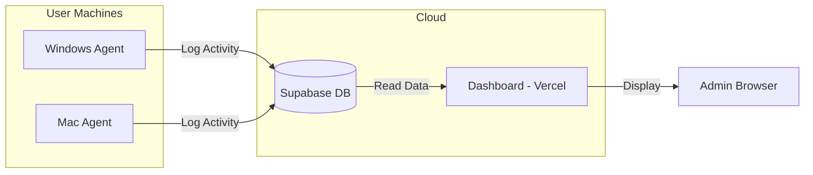
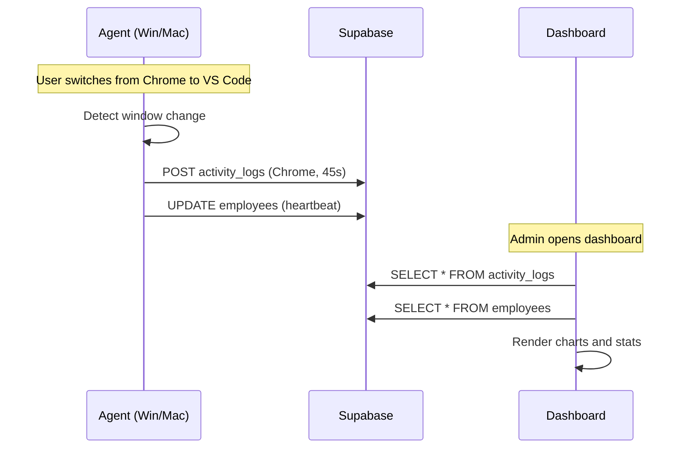

# Employee Monitor System - Technical Documentation

> **Last Updated:** December 13, 2025  
> **Repository:** https://github.com/Priinc3/Screentime.git  
> **Dashboard URL:** Deployed on Vercel

---

## Executive Summary

The Employee Monitor System is a cross-platform screen time tracking solution that monitors employee activity by tracking active windows and applications. It consists of three main components:



### How It Works (Simple Flow)

1. **Agents run in background** on Windows/Mac machines
2. **Agents detect app switches** (when user switches from Chrome to VS Code, etc.)
3. **Activity logged to Supabase** with app name, window title, and duration
4. **Heartbeats sent every 10 seconds** to show "online" status
5. **Dashboard reads from Supabase** and displays charts, stats, and activity logs

---

## Project Structure

```
Screen time v3/
├── dashboard/              # Next.js web dashboard (deployed to Vercel)
├── agent/                  # Windows agent (C#/.NET)
│   └── EmployeeMonitor/
├── mac_agent/              # macOS agent (Python)
├── docs/                   # SQL schemas and documentation
├── start_dashboard_mac.command
└── start_dashboard_win.bat
```

---

## Component 1: Dashboard (Next.js)

**Location:** `/dashboard/`  
**Tech Stack:** Next.js 16, React, TypeScript, Tailwind CSS, shadcn/ui, Recharts, Supabase Client

### Key Files

| File | Purpose |
|------|---------|
| `app/page.tsx` | Main dashboard with stats cards and charts |
| `app/employees/[id]/page.tsx` | Individual employee details page |
| `app/settings/page.tsx` | Settings with theme toggle and employee management |
| `components/RecentActivity.tsx` | Recent activity feed with employee names |
| `components/LoginDialog.tsx` | Login gate (credentials: joyspoon/JOY123) |
| `utils/supabase/client.ts` | Supabase client initialization |

### Charts

| Chart | File | Data Source |
|-------|------|-------------|
| Daily Activity | `components/charts/DailyActivityChart.tsx` | `activity_logs` aggregated by date |
| Top Apps | `components/charts/TopAppsBarChart.tsx` | `activity_logs` grouped by `app_name` |
| Hourly Activity | `components/charts/HourlyActivityChart.tsx` | `activity_logs` grouped by hour |
| App Usage Pie | `components/charts/AppUsagePieChart.tsx` | `activity_logs` grouped by `app_name` |

### Environment Variables (Vercel)

```env
NEXT_PUBLIC_SUPABASE_URL=https://cvrtaecpuwbyixxxiclt.supabase.co
NEXT_PUBLIC_SUPABASE_ANON_KEY=eyJhbGciOiJIUzI1NiIsInR5cCI6IkpXVCJ9...
```

### Deployment

- **Platform:** Vercel
- **Auto-deploy:** Pushes to `main` branch trigger automatic deployment
- **Root Directory:** `dashboard/` (configured in Vercel)

---

## Component 2: Windows Agent (C#/.NET)

**Location:** `/agent/EmployeeMonitor/`  
**Tech Stack:** .NET 8, C#, Supabase C# Client

### Key Files

| File | Purpose |
|------|---------|
| `Program.cs` | Entry point, handles `--install` and `--uninstall` flags |
| `Worker.cs` | Background service that polls active window every 1 second |
| `Services/WindowHelper.cs` | Windows API calls to get foreground window |
| `Services/SupabaseService.cs` | Supabase integration for logging |
| `Installer.cs` | Copies to ProgramData, adds to Windows Registry |
| `launcher.bat` | Interactive launcher with install/uninstall menu |

### How Windows Detection Works

```csharp
// Uses Win32 API via P/Invoke
[DllImport("user32.dll")]
private static extern IntPtr GetForegroundWindow();

[DllImport("user32.dll")]
private static extern int GetWindowText(IntPtr hWnd, StringBuilder text, int count);
```

### Config Location

```
C:\ProgramData\EmployeeMonitor\config.json
```

Content:
```json
{
  "EmployeeId": "uuid-here",
  "TargetWindowsUser": "username-or-empty"
}
```

### Persistence

- Copies itself to `C:\ProgramData\EmployeeMonitor\`
- Adds to `HKLM\SOFTWARE\Microsoft\Windows\CurrentVersion\Run`
- Runs on system startup as hidden process

---

## Component 3: Mac Agent (Python)

**Location:** `/mac_agent/`  
**Tech Stack:** Python 3, supabase-py, AppleScript (via osascript)

### Key Files

| File | Purpose |
|------|---------|
| `main.py` | Entry point with `--install` and `--uninstall` flags |
| `monitor.py` | Background loop that polls active window every 1 second |
| `window_helper.py` | AppleScript-based window detection |
| `supabase_service.py` | Supabase integration for logging |
| `installer.py` | Creates LaunchAgent for auto-start |
| `launcher.sh` | Interactive launcher with menu |

### How Mac Detection Works

> **Important:** PyObjC's NSWorkspace APIs don't work without Accessibility permissions. We use AppleScript instead.

```python
# Uses AppleScript via subprocess
app_script = 'tell application "System Events" to get name of first process whose frontmost is true'
result = subprocess.run(['osascript', '-e', app_script], capture_output=True)
```

### Config Location

```
~/Library/Application Support/EmployeeMonitor/config.json
```

### LaunchAgent Location

```
~/Library/LaunchAgents/com.employeemonitor.agent.plist
```

### Log Files

```
~/Library/Logs/EmployeeMonitor/stdout.log
~/Library/Logs/EmployeeMonitor/stderr.log
```

---

## Database Schema (Supabase)

### Tables

#### `employees`

| Column | Type | Description |
|--------|------|-------------|
| `id` | uuid | Primary key (matches auth.users) |
| `email` | text | Employee email |
| `full_name` | text | Display name |
| `department` | text | Department |
| `current_window` | text | Current window title (heartbeat) |
| `current_app` | text | Current app name (heartbeat) |
| `last_heartbeat` | timestamp | Last heartbeat time |
| `created_at` | timestamp | Registration date |

#### `activity_logs`

| Column | Type | Description |
|--------|------|-------------|
| `id` | bigint | Auto-increment primary key |
| `employee_id` | uuid | Foreign key to employees |
| `window_title` | text | Window title |
| `app_name` | text | Application name |
| `start_time` | timestamp | Activity start |
| `end_time` | timestamp | Activity end |
| `duration_seconds` | integer | Duration in seconds |
| `created_at` | timestamp | Log creation time |

### Row Level Security (RLS)

RLS policies allow anonymous inserts (for agents) and reads (for dashboard):

```sql
-- Allow anonymous inserts
CREATE POLICY "Allow anon insert" ON activity_logs FOR INSERT WITH CHECK (true);

-- Allow reads
CREATE POLICY "Allow all reads" ON employees FOR SELECT USING (true);
```

---

## Data Flow Diagram



---

## Troubleshooting Guide

### Dashboard Issues

| Problem | Cause | Solution |
|---------|-------|----------|
| Charts empty | No activity data | Check if agent is running and sending data |
| "Unknown" employee names | Employee ID not in `employees` table | Register employee via agent `--install` |
| Daily Activity chart empty | Date key mismatch | Check timezone handling in `getLocalDateKey()` |
| Supabase connection fails | Missing env vars | Set `NEXT_PUBLIC_SUPABASE_URL` and `NEXT_PUBLIC_SUPABASE_ANON_KEY` |

### Windows Agent Issues

| Problem | Cause | Solution |
|---------|-------|----------|
| Agent not starting | Not in Registry Run | Run `--install` as Administrator |
| Not logging activities | Wrong user targeted | Check `TargetWindowsUser` in config.json |
| Access denied errors | Not running as admin | Right-click → Run as Administrator |

### Mac Agent Issues

| Problem | Cause | Solution |
|---------|-------|----------|
| Only detects Terminal/Antigravity | Permission issue | Uses AppleScript now, should work |
| Agent not starting on login | LaunchAgent not loaded | Run `launchctl load ~/Library/LaunchAgents/com.employeemonitor.agent.plist` |
| No logs appearing | Python not using venv | Run via `launcher.sh` or `source venv/bin/activate` first |
| "ModuleNotFoundError" | Dependencies not installed | Run `pip install -r requirements.txt` in venv |

### View Mac Agent Logs

```bash
tail -f ~/Library/Logs/EmployeeMonitor/stdout.log
```

### Check if Mac Agent is Running

```bash
ps aux | grep main.py | grep -v grep
```

### Restart Mac Agent

```bash
launchctl unload ~/Library/LaunchAgents/com.employeemonitor.agent.plist
launchctl load ~/Library/LaunchAgents/com.employeemonitor.agent.plist
```

---

## Security Considerations

1. **Dashboard Login:** Simple password check (joyspoon/JOY123) stored client-side
2. **Supabase RLS:** Policies allow anonymous access - suitable for internal use only
3. **API Keys:** Supabase anon key is exposed in frontend (by design for Supabase)
4. **Agent Communication:** Uses HTTPS to Supabase

> ⚠️ **Warning:** This system is designed for internal/trusted network use. Do not expose to public internet without additional authentication.

---

## Tools & Technologies Used

### Dashboard

| Tool | Version | Purpose |
|------|---------|---------|
| Next.js | 16.0.10 | React framework |
| React | 19.0 | UI library |
| TypeScript | 5.x | Type safety |
| Tailwind CSS | 4.x | Styling |
| shadcn/ui | - | UI components |
| Recharts | - | Charts |
| Supabase JS | 2.x | Database client |
| Lucide React | - | Icons |
| next-themes | - | Dark mode |
| date-fns | - | Date utilities |

### Windows Agent

| Tool | Version | Purpose |
|------|---------|---------|
| .NET | 8.0 | Runtime |
| C# | 12 | Language |
| Supabase C# | - | Database client |
| Win32 API | - | Window detection |

### Mac Agent

| Tool | Version | Purpose |
|------|---------|---------|
| Python | 3.8+ | Runtime |
| supabase-py | 2.x | Database client |
| AppleScript | - | Window detection |
| launchd | - | Auto-start daemon |

### Infrastructure

| Tool | Purpose |
|------|---------|
| Supabase | PostgreSQL database + API |
| Vercel | Dashboard hosting |
| GitHub | Version control |

---

## Quick Reference Commands

### Dashboard

```bash
cd dashboard
npm run dev          # Start development server
npm run build        # Build for production
git push origin main # Deploy to Vercel
```

### Mac Agent

```bash
cd mac_agent
./launcher.sh        # Interactive menu
# OR
source venv/bin/activate
python main.py --install    # Install
python main.py --uninstall  # Uninstall
python main.py              # Run manually
```

### Windows Agent

```cmd
cd agent\EmployeeMonitor
launcher.bat         # Interactive menu
# OR
EmployeeMonitor.exe --install    # Install (requires admin)
EmployeeMonitor.exe --uninstall  # Uninstall
```

---

## Contact & Support

- **Repository:** https://github.com/Priinc3/Screentime.git
- **Supabase Project:** cvrtaecpuwbyixxxiclt.supabase.co

---

*This documentation was auto-generated and should be updated as the project evolves.*
